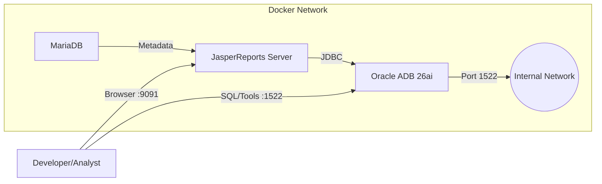

<p align="center">
  
</p>

# Oracle Database 26ai Integration for JasperReports Server

[](LICENSE)
[](https://www.oracle.com/database/free/)
[](https://community.jaspersoft.com/)

A comprehensive, containerized playground for integrating **Oracle Autonomous Database Free 26ai** with **JasperReports Server (Community Edition)**. This project enables developers and data analysts to explore the synergy between Oracle's latest AI-centric database and enterprise-grade reporting.

---

## 📖 Overview

This repository provides a production-ready **Docker Compose** environment that spins up:
1.  **Oracle Autonomous Database Free 26ai**: The latest version of Oracle's converged database, featuring native AI Vector Search, select AI, and integrated machine learning.
2.  **JasperReports Server (CE)**: A powerful reporting server backed by MariaDB, ready to consume data from Oracle ADB.

### Why Oracle ADB 26ai?
Oracle Database 23ai (and the Free 26ai container version) introduces groundbreaking features like **AI Vector Search**, allowing you to run semantic search directly on your data. By integrating this with JasperReports, you can create next-generation dashboards that not only visualize structured data but also provide insights derived from unstructured data processing and vector similarity queries.

## 🏗 Architecture

The solution uses a microservices-inspired architecture managed via Docker Compose:



- **`oracle-adb`**: Host for the Application/Data layer.
- **`jasper-server`**: The Reporting Application Server.
- **`mariadb`**: Repository database for JasperServer metadata.

## 🚀 Quick Start

### Prerequisites
- **Docker** and **Docker Compose** installed.
- **Git** installed.
- Minimum **8GB RAM** allocated to Docker (Oracle ADB is resource-intensive).

### 1. Clone the Repository
```bash
git clone https://github.com/eng-malek/Oracle-adb-26ai-Integration-for-Jasper-Report-Server.git
cd Oracle-adb-26ai-Integration-for-Jasper-Report-Server
```

### 2. Configure Oracle ADB
Go to the `oracle-adb` directory and set up your environment:
```bash
cd oracle-adb
cp .env.example .env
# Optional: Edit .env to set your own passwords
```
Create the required Docker assets:
```bash
docker network create oracle-adb-network
docker volume create oracle-adb-data
docker volume create oracle-adb-logs
```
Start the database:
```bash
docker compose up -d
```
*Wait a few minutes for the database to fully initialize.*

### 3. Configure JasperReports Server
Open a new terminal or move to the directory:
```bash
cd ../jasper-server
cp .env.example .env
```
Start the reporting server:
```bash
docker compose up -d
```

### 4. Access the Services
- **JasperReports Server**: [http://localhost:9091/jasperserver](http://localhost:9091/jasperserver)
    - Default User: `jasperadmin`
    - Default Pass: `jasperadmin`
- **Oracle Database**: `localhost:1522`
    - Service: `ORCLPDB1`
    - User/Pass: As configured in `.env`.

---

## 🔌 Connecting Jasper to Oracle

To query Oracle data from JasperReports, you must install the Oracle JDBC driver:

1.  **Download** `ojdbc8.jar` from Oracle's website.
2.  **Copy** it to the running Jasper container:
    ```bash
    docker cp ojdbc8.jar jasperreports:/opt/bitnami/jasperreports/apache-tomcat/lib/
    ```
3.  **Restart** the Jasper container:
    ```bash
    docker restart jasperreports
    ```
4.  **Create Data Source** in Jasper UI using URL: `jdbc:oracle:thin:@oracle-adb:1522/ORCLPDB1`

*(See [jasper-server/README.md](jasper-server/README.md) for detailed steps.)*

## 🤖 Leveraging AI Features

With Oracle ADB 26ai, you can enhance your reports with AI:
- **Vector Search**: Store embeddings of product descriptions or logs in Oracle.
- **Natural Language Queries**: Use `DBMS_CLOUD_AI` (if configured with external keys) to translate natural language questions into SQL for your reports.
- **Predictive Analytics**: Run In-Database Machine Learning (OML) models and visualize the predictions in JasperReports.

## 🔒 Security & Best Practices

- **Secrets Management**: This repo uses `.env` files. **Never commit your `.env` files.**
- **Oracle Wallet**: For secure mTLS connections, map your wallet directory in `oracle-adb/docker-compose.yaml`.
- **Network**: The database and report server communicate over an isolated Docker network (`oracle-adb-network`).

## 📂 Project Structure

```text
├── oracle-adb/       # Oracle ADB Container config & docs
├── jasper-server/    # JasperReports Server config & docs
├── image/            # Architecture diagrams & screenshots
├── .env.example      # (Inside subfolders) - Environment templates
└── docker-compose... # (Inside subfolders) - Service definitions
```

## 🤝 Contribution

Contributions are welcome! Please:
1.  Fork the repository.
2.  Create a feature branch.
3.  Submit a Pull Request.

## ⚠️ Disclaimer

This is an **unofficial** community project and is not an official Oracle product. Standard license terms apply.

---

**Maintained by:**  
**Eng. Malek Mohammed Al-edresi**  
*Oracle APEX & Database Developer | AI & Vector Search Enthusiast*
